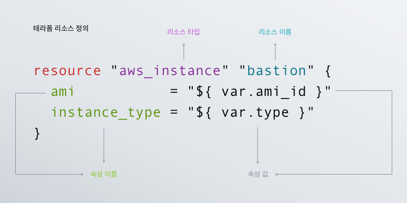

# terraform tf 파일 구성요소

## provider
``` js
terraform {
  required_providers {
    azurerm = {
      source  = "hashicorp/azurerm"
      version = ">= 2.26"
    }
  }
}
provider "azurerm" {
  features {}
}
```
terraform의 버전과 지원되는 provider 지정. feature를 통해 기능을 선별 할 수도 있음.  
azure의 경우 azurerm(Azrue Resource Management) 사용

## resource


- resource로 시작  
- 리소스 타입 지정
- terraform dir 내 동일한 resource/id 로 사용됨
- resource block 에서 다른 resource 참조시 [resource_typ].[resource_name].[속성명] 으로 사용됨
- resource block {} 내에 자원의 세부 속성을 설정
  ``` js
  resource "azurerm_network_interface" "devops" {
  name                = "AZ${var.devops.name}-nic"
  resource_group_name = azurerm_resource_group.devops.name
  location            = azurerm_resource_group.devops.location

  ip_configuration {
    name                          = "internal"
    subnet_id                     = module.devops.id
    private_ip_address_allocation = "Static"
    private_ip_address            = var.devops.ip
  }
  depends_on = [module.devops]
  tags       = module.const.tags
    }
    resource "azurerm_linux_virtual_machine" "devops" {
    name                = "AZ${var.devops.name}"
    resource_group_name = azurerm_resource_group.devops.name
    location            = azurerm_resource_group.devops.location
    size                = var.devops.size
    admin_username      = "adminuser"
    network_interface_ids = [
        azurerm_network_interface.devops.id,
    ]

    admin_ssh_key {
        username   = "adminuser"
        public_key = file("../id_rsa.pub")
    }

    os_disk {
        name                 = "AZ${var.devops.name}-osdisk-001"
        caching              = "ReadWrite"
        storage_account_type = "Standard_LRS"
        disk_size_gb         = 100
    }

    source_image_reference {
        publisher = "Canonical"
        offer     = "UbuntuServer"
        sku       = "18.04-LTS"
        version   = "latest"
    }
    depends_on = [azurerm_network_interface.devops]
    tags       = module.const.tags
    }
  ```

## module
> 기능을 재사용하기 위해 정의하는 경우 사용 
> module은 일반 variable/resource 등과 동일한 방법으로 작성되며,  
> caller에서 사용할 수 있도록 output을 정의 하여 caller가 module에서 생성한 값을 사용할 수 있음. 
> 

- module 정의 : ./subnet/main.tf  
  ``` js
  variable name { type = string }
  variable rg { type = string }
  variable vnet { type = string }
  variable cidr { type = list(string) }
  resource "azurerm_subnet" "subnet" {
    name                 = "${var.name}-001-subnet"
    resource_group_name  = var.rg
    virtual_network_name = var.vnet
    address_prefixes     = var.cidr
  }
  output "id" {
    value = azurerm_subnet.subnet.id
  }
  output "name" {
    value = azurerm_subnet.subnet.name
  }

  ```
- module 사용 : ./nogada/main.tf  
  module에서 output으로 지정한 값을 호출한 프로젝트에서 module 이름으로 사용할 수 있음
  ```js
  module "devops" {
    source = "../modules/subnet"
    name   = "${module.const.long-name}-${var.devops.name}"     #"skgc-vrd-prod-devops-koce"
    rg     = module.const.rg
    vnet   = module.const.vnet
    cidr   = var.devops.cidr
  }
  
  ######## assign hub routing rule
  resource "azurerm_subnet_route_table_association" "udr-association" {
    subnet_id      = module.devops.id
    ...
    depends_on = [module.devops]
  }
  ```
- output : module을 호출된 block에서 module의 처리 결과 값을 활용 할 수 있도록 지정
  ```js
  ```
## data source
> 실행되는 terraform 프로젝트에서 관리되는 자원이 아니나, 관리 대상자원과 관련된  
> 자원의 정보를 쉽게 처리 하기 위한 구성  
> 해당 클라우드에서 자원을 읽어 정보를 구성해줌(id, name, ip 등의 세부 정보)

``` js
data "azurerm_route_table" "udr" {
  name                = module.const.udr
  resource_group_name = module.const.rg
}

######## assign hub routing rule
resource "azurerm_subnet_route_table_association" "udr-association" {
  route_table_id = data.azurerm_route_table.udr.id
  ...
}
```
