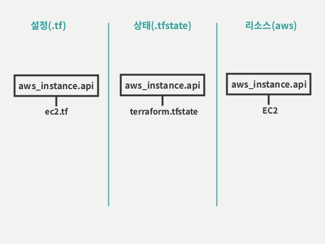

# terraform

> infra provisioning tool  
> automate create/update/delete/import

## state management

- 설정 : local machine의 tf 파일
- 상태 : local의 *.tfstate과 Remote State(aws S3, Azure blob)
  여러 사람이 공동 작업시 remote state 필요
- resource : 실제 관리되는 computing 자원

## detail

- [code block](block.md)
- [how to run](run.md)
- [structure](struncture.md)

> tips  
> 여러 프로젝트에서 공통으로 변수/상수 값을 사용하는 경우  
> module을 생성하고 output에 값을 지정.
> 사용되는 terraform에서 module을 import 하여 예) module.[module_name].[변수명 output_name]

